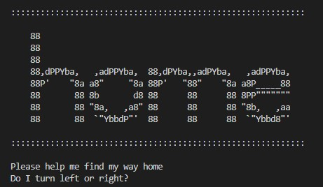

# simpleWordGame

**Author: Robert Ball**

Python Script that takes user input and checks against 'correct' answers to guide the player home

## Example



When a user runs this script they are greeted by this initial screen that asks them to find the way home for their character.

There are three prompts in total that the user will need to answer correctly in order to win the game.

A simple way to think about the process of incorrect versus correct answers is to view the prompts as a flow chart

```md
    Prompt 1
        |
   right wrong
   /        \
prompt 2     end
  |    \
right wrong
  |       \
prompt 3   end
  |    \
right wrong
  |     |
 end   end
```

The logic that determines if the game should continue with the next prompt or to end the game is a series of nested `if` and `elif` statements.

User input is converted to lower case and is checked against a variable that is assigned the "correct" answer which can only be the strings `"left"` or `"right"`.

If the user input equals variable that is assigned to the prompt then the script will progress to the next prompt. If the user input does not equal the variable assigned to the prompt then the script will end.

*[Ascii art attribution](https://ascii.co.uk/art/home)*